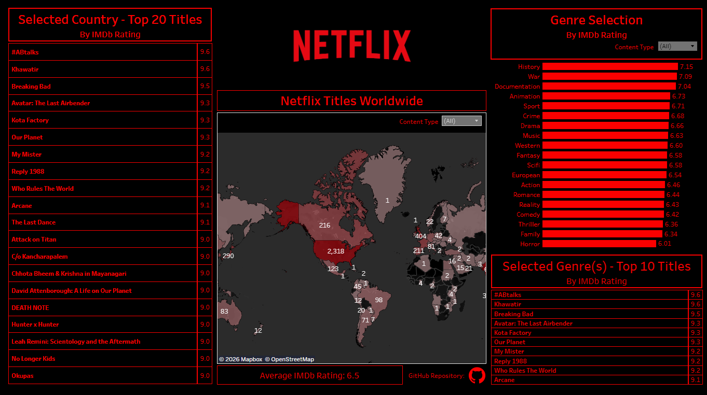

# 📊 Netflix Dashboard

Interactive Netflix dashboard built in Tableau Public. Tracks Netflix titles and ranks each title by IMDb rating. Allows users to search for top titles by content type, production country, and genre. 

Access dashboard on Tableau Public: https://public.tableau.com/app/profile/bill.guo6908/viz/NetflixDashboard_17708668260490/DashboardMain

Netflix data extracted from Kaggle: https://www.kaggle.com/datasets/maso0dahmed/netflix-movies-and-shows

---

## 📸 Dashboard Preview

---

## 🔍 Overview

Netflix allows viewers to search for movies and TV shows by content type, production country, or genre. However, there is no ranking system on Netflix. Ranking requires external services such as IMDb or Rotten Tomatoes. This dashboard allows viewers to search for popular Netflix titles ranked by IMDb score, based on user selected content type, production country, and/or genre. The dataset used for this project is from Kaggle. Some light data cleaning is performed in Python to prepare the dataset for Tableau. 

---

## 🛠️ Tech Stack

**Language**
- Python 

**Python Libraries**
- pandas — data cleaning, transformation, and aggregation  
- ast — safe parsing of string-encoded Python data structures

**Business Intelligence**
- Tableau — interactive dashboard
